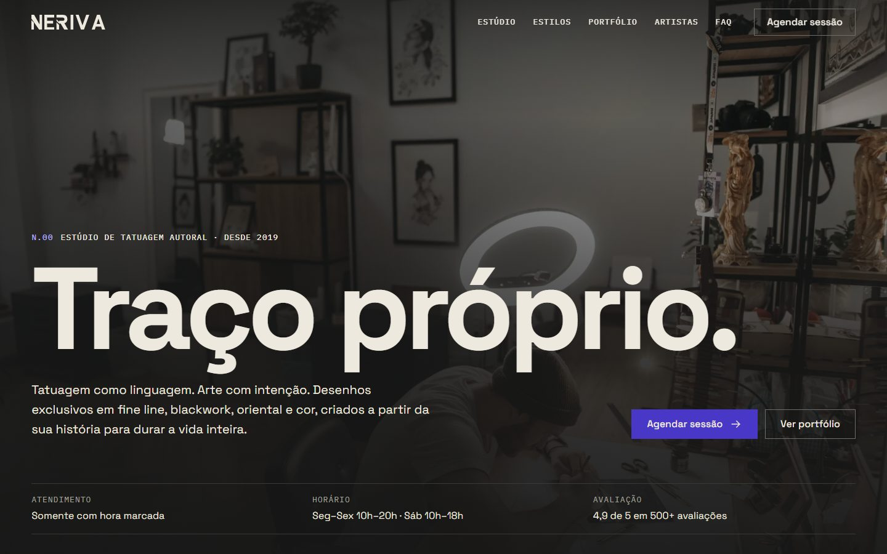

# NERIVA — Estúdio de tatuagem

Site demonstrativo para a NERIVA, um estúdio de tatuagem fictício: a identidade visual da marca aplicada a uma landing page responsiva. Projeto de portfólio de design e front-end.

**Ao vivo:** [neriva-delta.vercel.app](https://neriva-delta.vercel.app)



## Destaques

- **HTML, CSS e JavaScript puros**, sem etapa de build.
- **Identidade aplicada:** Space Grotesk e IBM Plex Mono; paleta Preto Tinta, Papel Quente, Azul Stencil e Cinza Mineral; padrão gráfico "N" refeito como ladrilho SVG.
- **Contraste medido (WCAG AA)**, inclusive nos pixels reais da foto sob o texto da hero.
- **Mobile-first**, sem rolagem horizontal de 390 a 1440 px.
- **Acessível por teclado:** menu com foco gerenciado, galeria com visualizador (setas e Esc), formulário com erro por campo que diz como corrigir.
- **Rolagem suave das âncoras com GSAP** (ScrollToPlugin), com aterrissagem precisa abaixo do cabeçalho; respeita `prefers-reduced-motion`.
- **Imagens WebP responsivas** (`srcset`), de 16 MB de originais para 1,8 MB.

## Estrutura

```
index.html        página única
css/styles.css    tokens, componentes e seções
js/main.js        menu, rolagem, filtros, visualizador, formulário
assets/           logo, padrão, favicon e imagens otimizadas
```

## Rodar localmente

Abra o `index.html` no navegador. Não há dependências para instalar.

## Observações

- Site demonstrativo: os links externos e o formulário não enviam nada.
- Nomes, endereço, números e depoimentos são fictícios.
- Fotos do [Pexels](https://www.pexels.com): Bertelli Fotografia, DQ Nguyen, Jesseth Fallas, Pavel Danilyuk, Ralph Rabago, Richard Cascaes Figueiredo e Shaiel Reyes.
